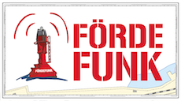

---
## Fördefunk.de
### Freies Internet für Flensburg.  

---
### Map
The map is generated from a file '*nodes.json*' in the root directory. This file gets generated by the [**ffmap-backend**](https://github.com/ffnord/ffmap-backend) and can be found under *http://yourffmap.url/nodes.json*. Only nodes that are marked as online are shown. The center and zoom can be adjusted in the file '*jquery.main.js*'.

### Styleguide
Need pictures, logos, fonts, colours and all that fancy stuff? Head to our [Styleguide](./doc/Styleguide/styleguide.md) and you will find answers to (almost) all your design related questions. [Click here.](./doc/Styleguide/styleguide.md)  

### Translation
Some of our documentation is written in german. Want to help translate it into english? Create a pull request!

---
### Created by:

- **@spralexx**
- **@roikiermedia**
- **@flemssound**

*Entypo Social Icons CC-BY-SA 4.0 by Daniel Bruce.*

---
*Fördefunk ist ein Projekt des Chaostreff Flensburg.*
